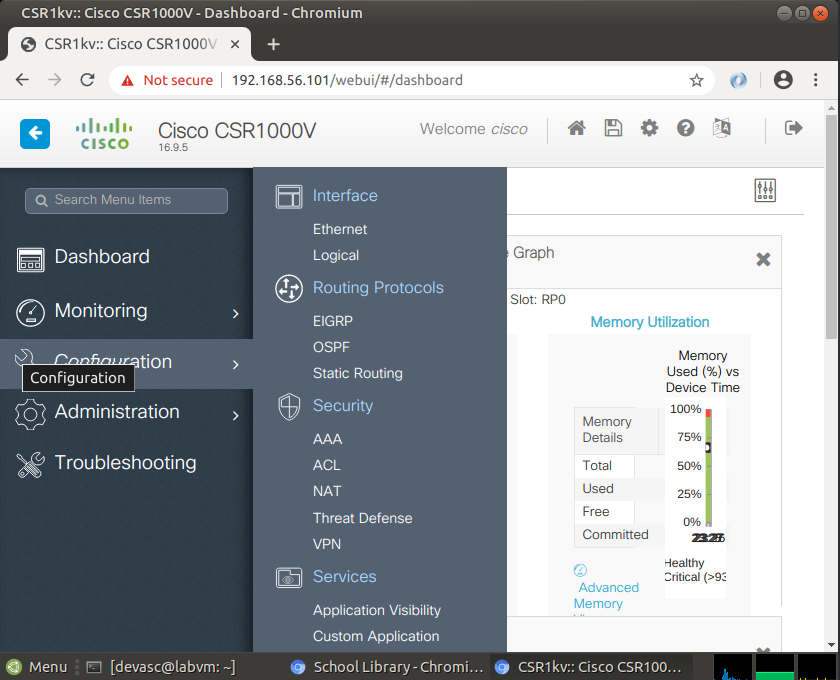

# Networking Expert 
## Lab 1 Install the virtual lab environment

### Preparation and Implementation
1. Installing virtualbox `sudo pacman -S virtualbox` installs the latest version 7.1.4-4
2. I used the files provided to me by the devnet course, these can be found in the resources tab. in this case the VM image
3. Installation of VM image can be achieved by importing the image via the virtualbox UI.

### Task Troubleshooting
1. No need for troubleshooting everything worked fine on the first try.

### Task Verification
1. On the VM itself i used the browser to check if it was able to connect to the internet.

## Lab 2 Install the CSR1000v VM

### Preparation and Implementation
1. I download the provided files from the file share 
2. I read the instructions of the corresponding lab
3. I created a new network interface in virtualbox, as mentioned in the guide. 
4. Now that the preparation was done, I started by importing the router into virtualbox.
5. Next I changed the iso file in the first cd drive to the one mentioned in the guide.
6. wait for success 
7. success

### Task Troubleshooting
1. I spend quet a bit of time on troubleshooting. mainly because the provided files on the fileshare didn't work. my guess is that the iso file for the installation was the cullprit.
2. I tried the install on both my machine (windows, linux) but the results were the same. I even tried downgrading the version of virtualbox because most resources that i found where pretty outdated.
3. Finally I used the iso file that was provided by devnet itself, this fixed the problem.
4. I saved the state of VM but when i tried to boot it again it gave me an out of memory error. when i checked my resources with the free command, i could see that i had 15GB ram in use. I used this command `echo 3 > /proc/sys/vm/drop_caches` now i had just enough memory. 

### Task Verification
1. I booted the VM and i was able to login to the router.
2. I pinged it from my host with success
3. I pinged the router from the VM i have created in lab 1
4. I used to ssh command to connect to router from my VM.
5. I logged in to webui for the router from the VM and did the same from my host

